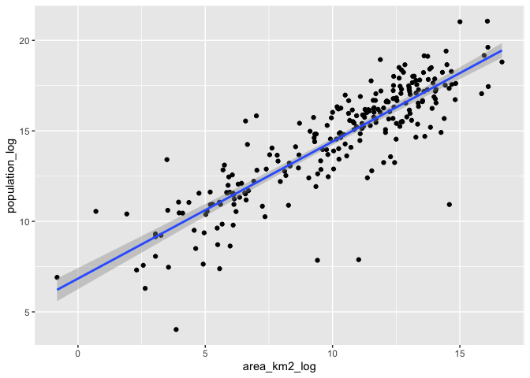
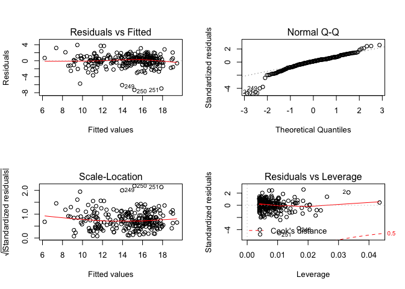

# Introduction

This document looks into the relationship between population and area by
country using the R programming language. The data used for this
analysis is from this [wikipedia
page.](https://en.wikipedia.org/wiki/List_of_countries_and_dependencies_by_population_density)

The ulimate goal of this analysis is to determine countries which are
over/under populated when compared against countries with similar area.

### Data preperation

Firstly, read in the data. This is farily easy to do in wikipedia.
Following this [blog
post](https://www.engineeringbigdata.com/web-scraping-wikipedia-world-population-rvest-r/)
helped me.

``` r
html <- "https://en.wikipedia.org/wiki/List_of_countries_and_dependencies_by_population_density"
xpath <- '//*[@id="mw-content-text"]/div/table'
global <- html %>% read_html() %>%
  html_nodes(xpath = xpath) %>% html_table()


pop_raw <- global[[1]] %>% as_tibble() %>% clean_names() 
head(pop_raw)
```

    ## # A tibble: 6 x 9
    ##   pos   country_or_depe… area_km2 area_mi2 population density_pop_km2
    ##   <chr> <chr>            <chr>    <chr>    <chr>      <chr>          
    ## 1 •     World (land onl… 134,940… 52,100,… 7,740,152… 57             
    ## 2 •     World (land onl… 148,940… 57,510,… 7,740,152… 52             
    ## 3 •     World (with wat… 510,072… 196,940… 7,740,152… 15             
    ## 4 –     Macau (China)    32.9     13       667,400    20,286         
    ## 5 1     Monaco           2.02     0.78     38,300     18,960         
    ## 6 2     Singapore        722.5    279      5,638,700  7,804          
    ## # … with 3 more variables: density_pop_mi2 <chr>, date <chr>,
    ## #   population_source <chr>

Looking at the first 6 rows we can see that this data is in need of a
good clean. In the next section of code I remove the commas and convert
the column to their correct types.s

``` r
pop <- pop_raw %>%
  mutate_at(c(
      "area_km2",
      "area_mi2",
      "population",
      "density_pop_km2",
      "density_pop_mi2"
    ),
   ~ str_replace_all(., ',', '') %>% as.numeric()
  ) %>%
  mutate(date = mdy(date),
         country_or_dependent_territory = str_remove(country_or_dependent_territory,'( *)\\[note .*')) %>%
  filter(!str_detect(country_or_dependent_territory,"World") ) %>%
  mutate_at(c("population","area_km2"),list(log = log))
head(pop)
```

    ## # A tibble: 6 x 11
    ##   pos   country_or_depe… area_km2 area_mi2 population density_pop_km2
    ##   <chr> <chr>               <dbl>    <dbl>      <dbl>           <dbl>
    ## 1 –     Macau (China)       32.9     13        667400           20286
    ## 2 1     Monaco               2.02     0.78      38300           18960
    ## 3 2     Singapore          722.     279       5638700            7804
    ## 4 –     Hong Kong (Chin…  1106      427       7482500            6765
    ## 5 –     Gibraltar (UK)       6.8      2.6       33140            4874
    ## 6 3     Vatican City         0.44     0.17       1000            2273
    ## # … with 5 more variables: density_pop_mi2 <dbl>, date <date>,
    ## #   population_source <chr>, population_log <dbl>, area_km2_log <dbl>

This looks much neater.

### Data Modelling

Now lets look at the relationship. As the below graph shows, their seems
to be a positive relationship between area and population. As area
doubles, population doubles also. I’ve used log as it helps model the
relationship better. Mathetically speaking I need to understand this
better.

``` r
pop %>% ggplot(aes(x = area_km2_log, y = population_log)) +
  geom_point() + geom_smooth(method = "lm")
```

<!-- -->

Now let’s build a model to help quanitfy this relationship.

``` r
pop_model <- lm(population_log ~ area_km2_log,pop)

summary(pop_model)
```

    ## 
    ## Call:
    ## lm(formula = population_log ~ area_km2_log, data = pop)
    ## 
    ## Residuals:
    ##     Min      1Q  Median      3Q     Max 
    ## -7.2989 -0.6551  0.1921  0.8465  3.9275 
    ## 
    ## Coefficients:
    ##              Estimate Std. Error t value Pr(>|t|)    
    ## (Intercept)   6.84004    0.29712   23.02   <2e-16 ***
    ## area_km2_log  0.75673    0.02771   27.31   <2e-16 ***
    ## ---
    ## Signif. codes:  0 '***' 0.001 '**' 0.01 '*' 0.05 '.' 0.1 ' ' 1
    ## 
    ## Residual standard error: 1.529 on 249 degrees of freedom
    ##   (1 observation deleted due to missingness)
    ## Multiple R-squared:  0.7496, Adjusted R-squared:  0.7486 
    ## F-statistic: 745.6 on 1 and 249 DF,  p-value: < 2.2e-16

Looking at the summary, it appears there is a relationship between the
two variables. The p value is less than 5% so we can reject the null
hypothesis. The R squared value of 0.75 informs us that the relationship
is strong but there is room for improving this model.

Let’s look at the residual plots to see if model follows assumptions.

``` r
par(mfrow=c(2,2))
plot(pop_model)
```

<!-- -->

As this is only for fun, I’m happy with the residual plots and model
statistics and feel it is suited for the purpose of this analysis.

Let’s obtain residuals and convert them back into normal figures rather
than log of population.

``` r
pop_aug <- pop_model %>% augment(pop) %>%
  mutate(.resid = round(exp(.fitted)-population),
         .fitted = round(exp(.fitted)),
         error = round(population/.fitted,2))
```

### Conclusions

Looking at the below, Macau and Singapore are two of the countries who
are over populated when compared against countries with similar area.

UK makes the top 20.

``` r
view_pop <- pop_aug %>%  filter(population > 100000) %>% select(country_or_dependent_territory,area_km2,population,.fitted,.resid,error)

view_pop %>% arrange(desc(error)) %>% head(20) %>%  kable(caption = "Over Populated Countries",format = "markdown",format.args = list(big.mark = ",",scientific =F))
```

| country\_or\_dependent\_territory |   area\_km2 |    population |     .fitted |          .resid | error |
| :-------------------------------- | ----------: | ------------: | ----------: | --------------: | ----: |
| Macau (China)                     |        32.9 |       667,400 |      13,143 |       \-654,257 | 50.78 |
| Singapore                         |       722.5 |     5,638,700 |     136,130 |     \-5,502,570 | 41.42 |
| Hong Kong (China)                 |     1,106.0 |     7,482,500 |     187,882 |     \-7,294,618 | 39.83 |
| Bangladesh                        |   143,998.0 |   167,404,248 |   7,482,788 |   \-159,921,460 | 22.37 |
| India                             | 3,287,240.0 | 1,353,476,800 |  79,810,376 | \-1,273,666,424 | 16.96 |
| Bahrain                           |       778.0 |     1,543,300 |     143,971 |     \-1,399,329 | 10.72 |
| South Korea                       |   100,210.0 |    51,811,167 |   5,687,483 |    \-46,123,684 |  9.11 |
| Taiwan                            |    36,197.0 |    23,590,744 |   2,631,879 |    \-20,958,865 |  8.96 |
| Philippines                       |   300,000.0 |   108,369,520 |  13,040,123 |    \-95,329,397 |  8.31 |
| Japan                             |   377,944.0 |   126,150,000 |  15,530,526 |   \-110,619,474 |  8.12 |
| China                             | 9,640,821.0 | 1,399,532,720 | 180,162,808 | \-1,219,369,912 |  7.77 |
| Pakistan                          |   803,940.0 |   206,327,217 |  27,494,048 |   \-178,833,169 |  7.50 |
| Palestine                         |     6,020.0 |     4,976,684 |     677,201 |     \-4,299,483 |  7.35 |
| Malta                             |       315.0 |       493,559 |      72,633 |       \-420,926 |  6.80 |
| Vietnam                           |   331,212.0 |    94,660,000 |  14,054,308 |    \-80,605,692 |  6.74 |
| Lebanon                           |    10,452.0 |     6,855,713 |   1,028,091 |     \-5,827,622 |  6.67 |
| Nigeria                           |   923,768.0 |   200,962,000 |  30,542,115 |   \-170,419,885 |  6.58 |
| Rwanda                            |    26,338.0 |    12,374,397 |   2,069,043 |    \-10,305,354 |  5.98 |
| United Kingdom                    |   242,910.0 |    66,435,600 |  11,114,962 |    \-55,320,638 |  5.98 |
| Netherlands                       |    41,526.0 |    17,351,428 |   2,920,135 |    \-14,431,293 |  5.94 |

Similarly, we can see French Guiana and Western Sahara are two countries
who are currently under populated when compared against countries of
similar area.

Interesting to see Canada there.

``` r
view_pop %>% arrange(error) %>% head(20) %>%  kable(caption = "Under Populated Countries",format = "markdown",format.args = list(big.mark = ",",scientific =F))
```

| country\_or\_dependent\_territory | area\_km2 | population |     .fitted |      .resid | error |
| :-------------------------------- | --------: | ---------: | ----------: | ----------: | ----: |
| French Guiana (France)            |    86,504 |    244,118 |   5,088,435 |   4,844,317 |  0.05 |
| Western Sahara                    |   252,120 |    567,421 |  11,432,420 |  10,864,999 |  0.05 |
| Iceland                           |   102,775 |    357,050 |   5,797,307 |   5,440,257 |  0.06 |
| Suriname                          |   163,820 |    568,301 |   8,249,890 |   7,681,589 |  0.07 |
| Mongolia                          | 1,564,100 |  3,000,000 |  45,495,033 |  42,495,033 |  0.07 |
| Guyana                            |   214,999 |    782,225 |  10,134,321 |   9,352,096 |  0.08 |
| Namibia                           |   825,118 |  2,413,643 |  28,040,386 |  25,626,743 |  0.09 |
| Botswana                          |   581,730 |  2,302,878 |  21,523,692 |  19,220,814 |  0.11 |
| Mauritania                        | 1,030,700 |  3,984,233 |  33,181,512 |  29,197,279 |  0.12 |
| Libya                             | 1,770,060 |  6,470,956 |  49,959,495 |  43,488,539 |  0.13 |
| Artsakh                           |    11,458 |    150,932 |   1,102,128 |     951,196 |  0.14 |
| New Caledonia (France)            |    18,575 |    258,958 |   1,588,579 |   1,329,621 |  0.16 |
| Gabon                             |   267,667 |  2,067,561 |  11,961,996 |   9,894,435 |  0.17 |
| Australia                         | 7,692,024 | 25,534,104 | 151,862,404 | 126,328,300 |  0.17 |
| Canada                            | 9,984,670 | 37,777,905 | 185,004,507 | 147,226,602 |  0.20 |
| Belize                            |    22,965 |    398,050 |   1,865,228 |   1,467,178 |  0.21 |
| Central African Republic          |   622,436 |  4,737,423 |  22,653,970 |  17,916,547 |  0.21 |
| Vanuatu                           |    12,281 |    304,500 |   1,161,525 |     857,025 |  0.26 |
| Abkhazia                          |     8,660 |    243,206 |     891,704 |     648,498 |  0.27 |
| Kazakhstan                        | 2,724,900 | 18,356,900 |  69,246,931 |  50,890,031 |  0.27 |

### Further Work

There is still work to do to improve model. The addingt the following
may be good starting points.

  - Average temperature
  - GDP per capita
  - Mountinous area
